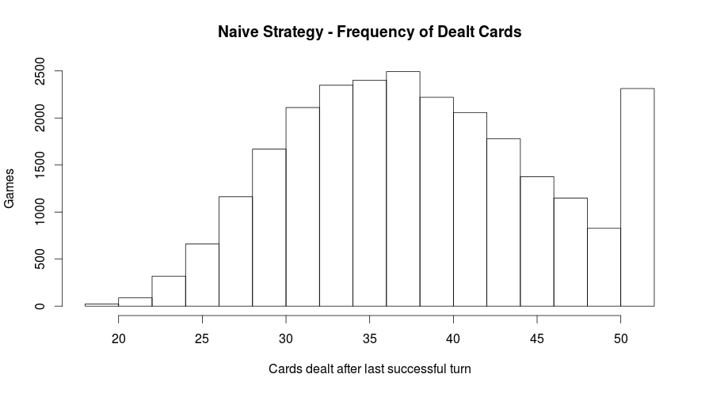
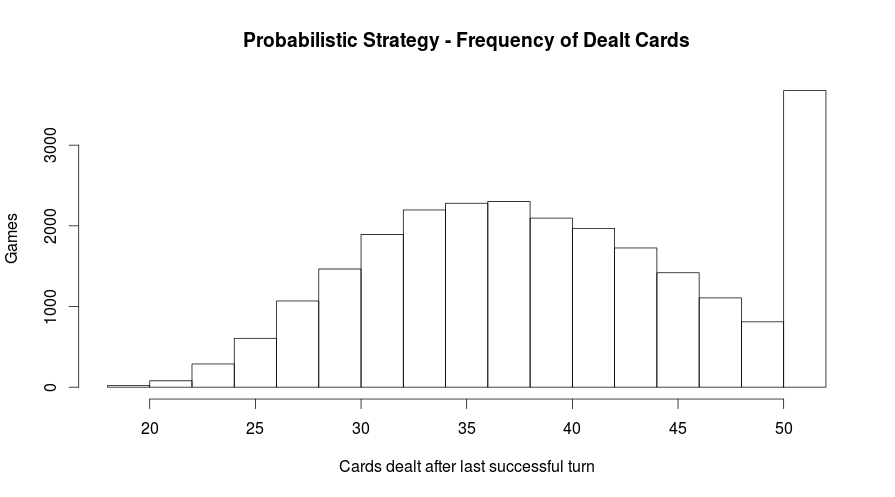

# A Statistical Analysis of 2 Strategies for Beat the Box
**Richard Krajunus**

## Abstract
I was introduced to Beat the Box on a snowboarding trip to Vail, CO.  My friends 
and I had a great time playing in our hotel room after a day's ride, however 
after about our 3rd loss in a row we began to think what any normal person 
would: THIS GAME IS IMPOSSIBLE!  We tried for days without luck, and it seemed 
that rumors of people winning were more myth than reality.

To test this hypothesis, I wrote a program which played the game with 25,000 decks using a naive strategy and found that the program won 7.8% of the time.  When using a probabilistic strategy, the program won 14.7% of the time.

The game is difficult but not impossible.

## Rules
I'll begin with a quick discussion of the rules, since I can't find a link to 
the rules anywhere online.  If you know this game by another name, let me know.

### Setup
The game may be played with any number of players.  To setup:

1. Shuffle a 52 card deck
1. Deal 9 cards face up in a 3x3 grid
1. The dealer holds the rest of the cards facedown

### Play
1. The first player must guess out loud whether the next card to be dealt will be
higher or lower than one of the cards in the 3x3 grid.  The order of the cards, 
from high to low are A, K, Q, J, 10 - 2.  If a grid is arranged like:
  ```
  J 6 4
  K 8 5
  6 Q 7
  ```
then it's common to hear the first player guess, "Lower than a King."

1. The dealer would then deal the top card from the deck face up onto the King.
If the dealt card is a King, or higher than a King then that pile is turned over.
If the dealt card is lower than a King, then card is placed on top of the King
face up.
1. The next player then makes their guess among any of the cards which are face 
up, and so on.
1. If the dealer deals an 8, on top of an 8 then that pile remains face up and 
the player gets a new turn.
1. If the dealer deals all the cards and at least 1 pile is face up, then the 
game is won.  The game is lost after the last face up pile is turned over.

## Strategy Definitions
There are at least 2 programmable strategies to Beat the Box:

* Naive - Identify the face up card which is furthest away from 8, since 8 lies 
at the middle of the range Ace - 2.  If the face up card is above 8, guess that 
the dealt card will be lower, and if the card is below 8, then guess that the 
dealt card will be higher.  If the chosen face up card is 8, then randomly guess
either higher or lower.  For example, if a grid is arranged like:
  
  ```
  J 6 4
  A 8 5
  6 Q 7
  ```
then guess the dealt card will be lower than the Ace.
* Probabilistic - Remember all the cards which have been dealt, and then for 
each card that's face up, compute the probabilities that the dealt card will be 
higher or lower than that card.  Then make the guess which corresponds to the 
maximum probability.

## Results
A computer playing according to the naive strategy can win 7.8% of time.  The median number of cards successfully dealt in each game is 38, and the mean is 38.4 with standard deviation of 7.5.  *Loosely*, this means that 66% of the time, the game will end after 38.4 cards are dealt plus or minus 7.5, and 95% of the time, the game will end after 38.4 cards plus or minus 15 cards (plus or minus 2 standard deviations).  I say loosely, because the 66% and 95% approximations assume that the number of cards dealt will follow a bell curve, but actually the number of cards dealt is capped at 52.  Sometimes a picture is worth a thousand words:


When playing according to the probabilistic strategy, can win 14.7% of the time.  The median number of cards successfully dealt in each game is 39, and the mean is 39.4 with standard deviation of 8.0.


These results are taken from our sample of 25,000 decks, however, are 25,000 
decks enough to make generalizations about how winnable the game is?  Would the results be much different if our program played every possible deck?  How many possible decks are there?

There are 9.2x10<sup>49</sup> possible decks when suits are not considered.  To put this number in perspective:
* 4x10<sup>17</sup> seconds have elapsed since the Big Bang
* 4x10<sup>17</sup> is the number of ways to scramble a Rubik's cube
* 5x10<sup>22</sup> stars are in the observable Universe
* between 10<sup>43</sup> and 10<sup>46.7</sup> possible positions can occur in chess
* 10<sup>80</sup> atoms are in the observable Universe

How confident can we be that our results over these 25,000 decks would be duplicated if we theoretically repeated the experiment over each of the 10<sup>49</sup> decks?  To find out couldn't we just run the program against each of these decks, instead of the randomly chosen 25,000 decks?

Playing both strategies through 25,000 decks takes about 75 seconds on my computer, so playing through 10<sup>49</sup> decks should take (roughly) 10<sup>47</sup> seconds.  If at the dawn of time, I ran the program against every deck with my computer, then today I'd still be closer to the beginning of the problem than to the end.

Since our main focus is in a binary outcome, whether the games are won or lost, we can construct a binomial confidence interval to tell us what our results can say about the unplayed decks.  For the naive strategy at the 99% confidence level, the interval is 7.7% - 8.2%, and for the probabilistic strategy the interval is 14.7% - 15.3%.  Another way of saying this, is that if we repeated the experiment for every deck, then 99% of the time the naive strategy would succeed 7.7% - 8.2% of the time, and the probabilistic strategy would succeed 14.7% - 15.3% of the time.